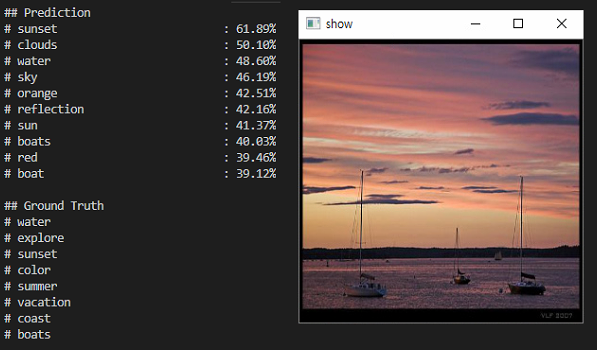
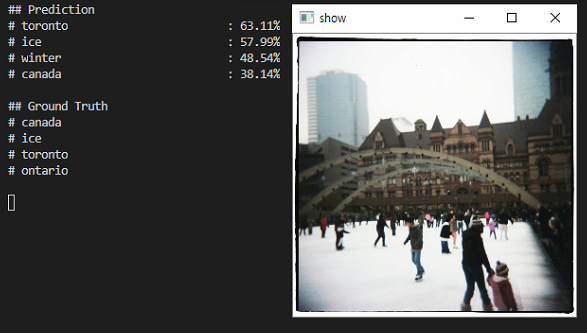
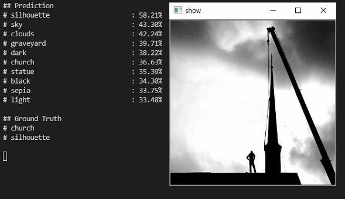
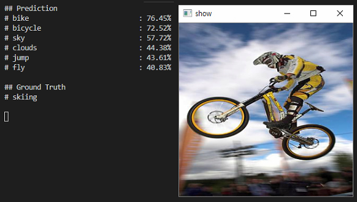
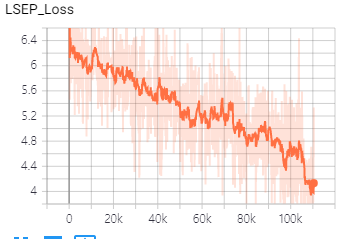
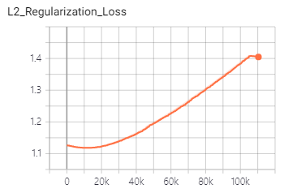
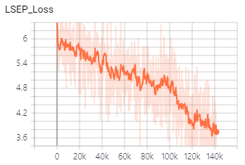
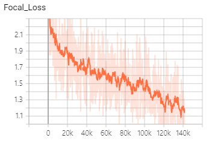
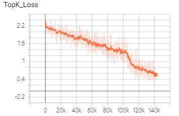
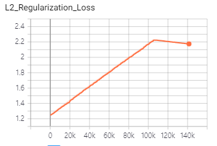

# Improving Pairwise Ranking for Multi-Label Image Classification

## # Summary
1. LSEP Loss (log-sum-exp pairwise)
2. Label Decision (Label count estimation + Threshold estimation)

## # Difference from Paper
1. VGG16 -> Inception ResNet v2
2. binary-cross-entropy (with sigmoid) -> Focal Loss

## # Results (NUS-WIDE Tags : 1K)
| Model  | Precision | Recall | mAP |
| ------------- | ------------- | ------------- | ------------- |
| WARP  | 18.3%  | 30.8% | 24.55% |
| CNN-RNN (CVPR2016) | 18.5% | 31.2% | 24.85% |
| S-CNN-RNN (CVPR2017) | 19.0% | 30.2% | 24.60% |
| Multi-label Triplet Embeddings (ICML 2018) | 19.8% | 32.7% | 26.25% |
| (self) Inception ResNet v2 (LSEP -> Label Decision) | 30.74% | 21.52% | 26.13% |

## # Test Samples

## # Tensorboard
### 1. LSEP Loss

### 2. Label Decision

## # Reference
- WARP: Deep Convolutional Ranking for Multilabel Image Annotation
- CNN-RNN: A Unified Framework for Multi-label Image Classification
- Semantic Regularisation for Recurrent Image Annotation
- Improving Pairwise Ranking for Multi-label Image Classification
- Multi-label Triplet Embeddings for Image Annotation from User-Generated Tags